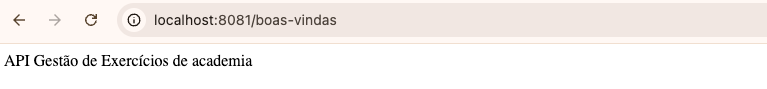
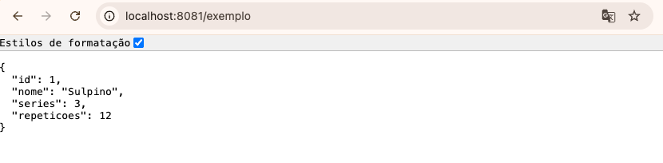
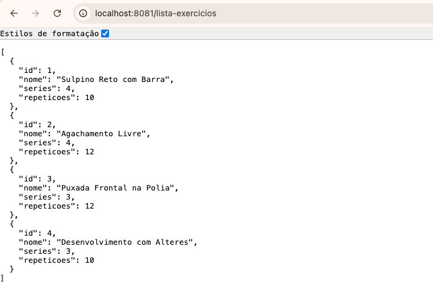

# 🏋️‍♂️ Gestão Academia API

[](https://oracle.com/java/)
[](https://spring.io/projects/spring-boot)
[](https://maven.apache.org/)

API REST desenvolvida em **Java 21** e **Spring Boot** para gerenciamento e listagem de exercícios de academia.

---

## 🛠️ Tecnologias Utilizadas

- **Java 21**
- **Spring Boot 4.1.1** - Framework para criação de microsserviços e APIs REST.
- **Spring Web** - Cria APIs REST e aplicações web usando o MVC.
- **Spring DevTools** - Recarrega a aplicação automaticamente ao alterar o código.
- **Apache Maven** - Gerenciador de dependências e build.

---

## 🚀 Como Executar

### 📋 Pré-requisitos

Certifique-se de ter instalado em sua máquina:
- [JDK 21](https://www.oracle.com/java/technologies/downloads/#java21)
- [Maven](https://maven.apache.org/)

### ⚙️ Passo a Passo

1. **Clone o repositório:**
   ```bash
   git clone git@github.com:rosaneneckel/gestao-academia.git
   cd gestao-academia
---
2. **Configure o application.properties:**

   src/main/resources/application.properties 

   Nome da aplicação: spring.application.name=academia

   Porta: server.port=8081
---
3. **Rotas:**

- 💬 @GetMapping("/boas-vindas"): texto - retorna uma mensagem de boas vindas.
- 🏋️ @GetMapping("/exemplo"): objeto. - retorna um exercício de exemplo (utilizando *Java Records*).
- 📋 @GetMapping("/lista-exercicios"): lista - retorna uma lista com 4 exercícios cadastrados

---
2. **Prints de Execução da API:**

  **boas-vindas (texto)**
  

  **exemplo (objeto)**

  

  **lista-exercicios (lista)**
  

3. **Perguntas:**
- Em nenhum lugar do seu projeto existe new ReceitaController(). Então quem criou esse objeto, e quando?

R: O Spring cria o objeto automaticamente durante a inicialização da aplicação.


- Você não escreveu uma linha convertendo objeto em JSON. Como o Spring soube fazer isso sozinho? 

R: O Spring Boot converte objetos para JSON automaticamente usando os HttpMessageConverters do Spring MVC e a biblioteca Jackson, incluída no spring-boot-starter-web. Assim, basta retornar um objeto Java que ele é serializado para JSON na resposta HTTP